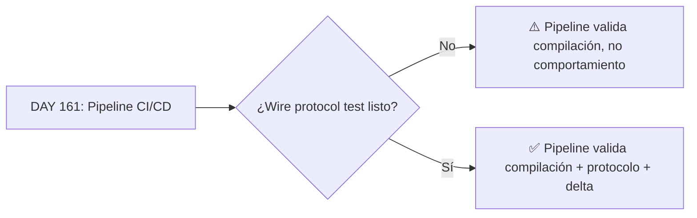

# 🏛️ RESPUESTAS DEL CONSEJO — DAY 161

*Para: Alonso Ruiz-Bautista, Arquitecto de aRGus NDR*
*Asunto: Pipeline CI/CD Jenkins/Vault + decisiones de empaquetado*

---

## ✅ Q1 — Imagen de producción: ¿`.deb` o Vagrant box?

**Recomendación: Ambos, con estrategia escalonada.**

| Artefacto | Uso recomendado | Justificación |
|-----------|----------------|---------------|
| **`.deb`** | Producción física (RPi5, N100) | Es el formato nativo de Debian, compatible con `apt`, permite actualizaciones incrementales y auditoría de dependencias [[11]]. Ideal para el gate FEDER. |
| **Vagrant box** | Validación rápida, CI, demos internas | Permite reproducibilidad exacta del entorno sin tocar hardware. Útil para pruebas E2E antes del deploy físico [[14]][[16]]. |

**Estrategia práctica para DAY 161:**
```bash
# Makefile targets sugeridos
make package-deb        # Genera aRGus-ndr_0.9.4_arm64.deb
make package-vagrant    # Exporta box desde la VM de build
make deploy-physical    # scp + dpkg -i en hardware UEx (simulado)
make deploy-vagrant     # vagrant up para validación rápida
```

> 💡 **Tradeoff gestionado**: El `.deb` es tu artefacto de *release*; la Vagrant box es tu artefacto de *validation*. Mantén ambos en el mismo pipeline, pero marca claramente cuál es el "source of truth" para FEDER: el `.deb`.

---

## ✅ Q2 — Valores naive en JSON contrato: ¿hardcoded o generados?

**Recomendación: Hardcoded para DAY 161, pero con hook de detección para DAY 162+.**

```cpp
// config/contract_defaults.hpp (DAY 161)
constexpr ContractValues DEV_DEFAULTS {
    .hwm = 1000,
    .io_threads = 4,
    .batch_size = 256,
    .timeout_ms = 3000
};

// config/contract_detector.hpp (BACKLOG-ZMQ-TUNING-001)
class ContractAutoTuner {
public:
    static ContractValues detect_safe_minimums();
    // → lee /proc/cpuinfo, meminfo, benchmark ligero de ZeroMQ
};
```

**Justificación**:
- Para el gate FEDER, la reproducibilidad es más crítica que la optimización automática.
- Los valores "naive" bien documentados permiten validar la arquitectura sin ruido de tuning.
- El script de detección puede añadirse después sin romper el pipeline actual.

> ⚠️ **Advertencia**: Documenta explícitamente en `README.md` que los valores son *development defaults* y que el tuning automático está pendiente en `BACKLOG-ZMQ-TUNING-001`.

---

## ✅ Q3 — Token enterprise en CI/CD: ¿Jenkins Credentials o fichero en VM?

**Recomendación: Jenkins Credentials Store + HashiCorp Vault Plugin con AppRole.**

```groovy
// Jenkinsfile snippet recomendado
withCredentials([
    vaultAppRole(
        credentialsId: 'argus-vault-approle',
        roleIdVariable: 'VAULT_ROLE_ID',
        secretIdVariable: 'VAULT_SECRET_ID'
    )
]) {
    sh '''
        # Login con AppRole → token de corta vida
        VAULT_TOKEN=$(vault write -field=token auth/approle/login \
            role_id="$VAULT_ROLE_ID" secret_id="$VAULT_SECRET_ID")
        
        # Plugin enterprise usa VAULT_TOKEN para cargar seed
        export ARGUS_ENTERPRISE_TOKEN="$VAULT_TOKEN"
        make test-enterprise-plugin
    '''
}
```

**Por qué AppRole y no token estático** [[1]][[3]][[5]]:
| Criterio | Token estático | AppRole (recomendado) |
|----------|---------------|----------------------|
| Rotación | Manual, propenso a olvido | Automática, TTL configurable |
| Auditoría | Difícil de rastrear | Cada login registrado en Vault |
| Blast radius | Compromiso = acceso total | Token de corta vida + políticas scoped |
| Compliance | Riesgo alto para FEDER | Alineado con principios de least privilege |

**Configuración mínima en Vault**:
```bash
# Crear AppRole para Jenkins
vault write auth/approle/role/argus-ci \
    secret_id_ttl=10m \
    secret_id_num_uses=1 \
    token_ttl=1h \
    token_policies=argus-enterprise-read

# Generar credentials una vez (solo para Jenkins Credentials)
vault read auth/approle/role/argus-ci/role-id
vault write -f auth/approle/role/argus-ci/secret-id
```

> 🔐 **Nota de seguridad**: Nunca almacenes el `secret_id` en texto plano en el Vagrantfile o en el repo. Usa `vault unwrap` con response wrapping para la entrega inicial [[5]].

---

## ✅ Q4 — DEBT-WIRE-PROTOCOL-TEST-001 y DEBT-E2E-LIVE-DELTA-001: ¿Antes o después del pipeline?

**Recomendación: Antes. Son cimientos, no decoración.**



**Justificación técnica**:
- Un pipeline que pasa sin tests de wire protocol da falsa confianza: el artefacto se construye, pero no garantiza interoperabilidad.
- `DEBT-WIRE-PROTOCOL-TEST-001` valida la capa de comunicación crítica para ZeroMQ/eBPF; si falla en producción, el sistema es inútil aunque el `.deb` se instale perfectamente.
- `DEBT-E2E-LIVE-DELTA-001` asegura que el procesamiento en tiempo real cumple SLA; sin esto, no puedes medir impacto de cambios en el pipeline.

**Plan de acción mínimo para DAY 161**:
1. Implementar **un** test de smoke para wire protocol (ej: handshake básico + echo).
2. Integrarlo como etapa temprana en el pipeline (`stage('Wire Protocol Smoke')`).
3. Dejar los tests completos para DAY 162, pero con el hook ya presente.

> 🎯 **Principio**: *"Un pipeline sin tests de protocolo es como un coche sin frenos: arranca, pero no lo llevarías a la autopista."*

---

## ✅ Q5 — Vault dev mode en CI/CD: ¿Aceptable para el gate FEDER?

**Respuesta corta: No para producción, sí para desarrollo y validación temprana.**

**Estado recomendado por fase**:

| Fase | Modo Vault | Justificación |
|------|-----------|---------------|
| **DAY 161-165 (Dev/CI)** | `vault server -dev` | Rápido, inmem, suficiente para validar integración del plugin [[18]][[22]]. |
| **Pre-FEDER (Staging)** | Vault prod con TLS + auto-unseal | Necesario para validar persistencia, rotación y auditoría [[19]][[25]]. |
| **FEDER Gate (Producción)** | Vault HA con Raft + HSM/Cloud auto-unseal | Requisito de seguridad para despliegue en hardware físico. |

**Plan de migración sugerido**:
```bash
# DAY 161: Dev mode (actual)
make vault-dev-start  # inmem, sin TLS, root token

# DAY 170: Staging mode (DEBT-JENKINS-PROD-001)
make vault-staging-start  # file backend, TLS self-signed, unseal keys en Jenkins Credentials

# FEDER: Production mode
# → Vault cluster con Raft, auto-unseal en AWS KMS/Azure Key Vault, políticas auditadas
```

> ⚠️ **Advertencia crítica**: Vault dev mode **nunca** debe usarse para almacenar secretos reales ni para validar flujos de producción [[18]]. Úsalo solo para validar que el plugin `vault_crypto` se conecta y deriva seeds correctamente.

---

## 📋 RESUMEN DE ACCIONES PARA DAY 161

```makefile
# Nuevos targets sugeridos para Makefile
.PHONY: package-deb package-vagrant pipeline-smoke-test

package-deb:
	@echo "→ Generando .deb para arquitectura objetivo..."
	# dpkg-deb --build, firma opcional para FEDER

package-vagrant:
	@echo "→ Exportando Vagrant box desde VM de build..."
	# vagrant package --output argus-ndr-dev.box

pipeline-smoke-test:
	@echo "→ Ejecutando smoke tests de wire protocol..."
	# ./tests/wire_protocol_smoke.sh --timeout 30s

# Pipeline Jenkins integrado
JENKINS_STAGES = \
	checkout \
	bootstrap \
	test-unit \
	test-enterprise-plugin \
	pipeline-smoke-test \
	package-deb \
	deploy-vagrant-validation
```

---

## 🔚 CIERRE DEL CONSEJO

Alonso, el trabajo de DAY 160 es excepcional: interfaz C++20 limpia, tests RED→GREEN, y fixes de provision documentados. Para DAY 161:

1. **Prioriza cimientos**: Wire protocol tests antes de empaquetar.
2. **Seguridad por diseño**: AppRole + Jenkins Credentials, nunca tokens estáticos.
3. **Dual-track packaging**: `.deb` para FEDER, Vagrant para validación ágil.
4. **Vault dev mode con fecha de caducidad**: Planifica DEBT-JENKINS-PROD-001 para antes del gate final.

> 🛡️ *"La calidad no es un acto, es un hábito."* — Tu pipeline debe reflejar el mismo rigor que tu interfaz `ICryptoProvider`.

**Próxima revisión**: DAY 162, con foco en `BACKLOG-ZMQ-TUNING-001` y la integración de valores auto-detectados en JSON contrato.

*— El Consejo de Sabios de aRGus NDR* 🏛️✨