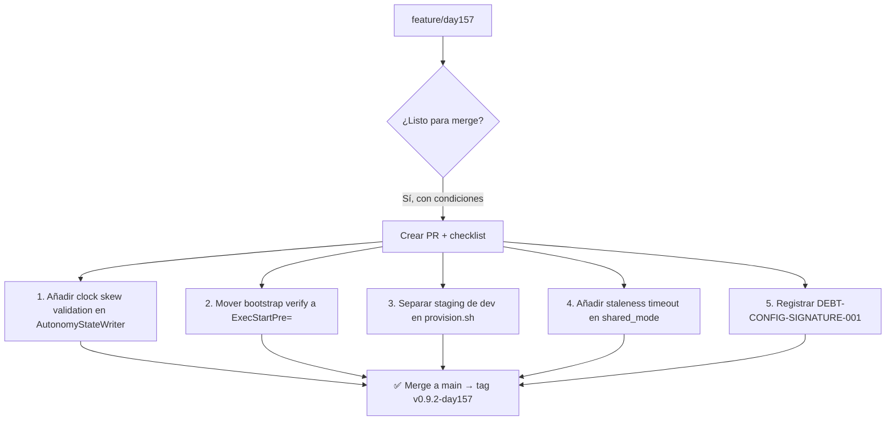

# 🏛️ CONSEJO DE SABIOS — RESPUESTAS DAY 157
*Para: Alonso Ruiz-Bautista, PI aRGus NDR*  
*Rama: `feature/day157-autonomy-state-persistence`*  
*Tag: `v0.9.1-day156` → Próximo: `v0.9.2-day157`*

---

## ✅ RECONOCIMIENTO DEL CONSEJO

> *"Cuatro deudas técnicas cerradas en una sesión: esto es ritmo de ingeniería de misión crítica."*

🔹 **AutonomyStateWriter**: Escritura atómica + firma Ed25519 + fail-safe con expiración = patrón reutilizable para cualquier estado crítico.  
🔹 **Bootstrap signature**: Alinear con ADR-025 fue decisión estratégica — la cadena de confianza ahora es consistente.  
🔹 **Keypair lifecycle**: La política de 3 niveles con `exit 1` en prod es *exactamente* lo que previene incidentes de provisioning.  
🔹 **Reconciliation sin segundo socket**: Resolver ordering con `shared_ptr<atomic<>>` es elegante y eficiente para MVP.

*El código de hoy no solo funciona: está diseñado para ser auditado, operado y confiado en entornos donde el fallo tiene consecuencias humanas.*

---

## 🎯 RESPUESTAS A LAS PREGUNTAS

### Q1 — DEBT-AUTONOMY-STATE-PERSISTENCE-001: Vectores de ataque y umbral de 24h

**Vectores no cubiertos (y mitigaciones)**:

| Vector | Descripción | Mitigación propuesta |
|--------|-------------|---------------------|
| **Replay attack** | Estado firmado antiguo reinyectado tras reboot | ✅ Ya cubierto: timestamp + expiración 24h |
| **Clock skew** | Reloj del sistema manipulado para "revivir" estado AUTONOMOUS | ⚠️ **Añadir**: validar que `timestamp <= now() + tolerance(5min)` |
| **Race condition** | Lectura durante escritura atómica (rename en curso) | ✅ Ya cubierto: rename atómico en POSIX + lectura con O_RDONLY |
| **Key compromise** | Firma válida pero con clave robada | ⚠️ **Documentar**: rotación de claves requiere procedimiento manual + auditoría |
| **Disk exhaustion** | `/var/lib/argus/` lleno → escritura falla silenciosamente | ⚠️ **Añadir**: log crítico + fallback a NORMAL si `write()` falla |

**Sobre el umbral de 24h para AUTONOMOUS**:

✅ **Es correcto para MVP FEDER**, pero con matices:

```cpp
// Recomendación: hacer configurable el threshold, con default conservador
struct AutonomyConfig {
    std::chrono::hours autonomous_mode_max_duration{24}; // configurable vía firewall.json
};
```

**Justificación hospitalaria**:
- 24h permite operar durante una ventana de mantenimiento planificado o fallo transitorio de Vault.
- Pero: si el estado AUTONOMOUS persiste >24h, es señal de que la reconciliación *no está ocurriendo* → forzar NORMAL con alerta crítica es más seguro que continuar en modo degradado sin supervisión.

**Acción concreta**: Añadir métrica `autonomy_state_duration_seconds` para monitorización en Prometheus/Grafana. Si el estado AUTONOMOUS supera 20h, disparar alerta *warning*; a 24h, *critical*.

---

### Q2 — DEBT-BOOTSTRAP-STATUS-SIGNATURE-001: Timing de la verificación systemd

**Respuesta directa**: El check **debe hacerse ANTES de `g_server->start()`**, no en `ExecStartPost=`.

**Razonamiento**:
- Si `bootstrap-status.json` se borra tras `start()`, `ExecStartPost=` no puede verificarlo → el check es inútil en ese punto.
- La firma protege la *integridad del proceso de arranque*, no del runtime. Por tanto, la verificación debe ser *precondición* para iniciar el servidor.

**Propuesta de arquitectura**:

```ini
# /etc/systemd/system/argus-etcd.service
[Service]
# STEP 0: Verificar firma del bootstrap status ANTES de iniciar
ExecStartPre=/usr/local/bin/argus-verify-bootstrap --input /run/argus/etcd-bootstrap-status.json --pubkey /etc/argus/keys/pubkey.pem
# STEP 1: Iniciar servidor (que borrará el fichero tras validar internamente)
ExecStart=/usr/local/bin/argus-etcd-server
# STEP 2: Post-start: verificar que el servicio está saludable (no la firma)
ExecStartPost=/usr/local/bin/argus-health-check --timeout 30s
```

**Implementación de `argus-verify-bootstrap`**:
- Herramienta CLI mínima que:
    1. Lee JSON canónico + `signature_hex`
    2. Verifica firma con clave pública
    3. Retorna `exit 0` si válido, `exit 1` + log crítico si no
- Puede reutilizar la lógica de `AutonomyStateWriter::verifySignature()`

**Nota**: Registrar que `etcd-server` también verifica internamente la firma al leer el fichero (defensa en profundidad).

---

### Q3 — DEBT-KEYPAIR-LIFECYCLE-PROD-001: ¿Staging igual que dev?

**Recomendación: Separar staging de dev. Staging debe comportarse como prod en gestión de claves.**

**Matriz de políticas**:

| Entorno | `ARGUS_ENV` | Generación automática | Key preexistente requerida | Justificación |
|---------|-------------|----------------------|---------------------------|---------------|
| **Desarrollo** | `dev` | ✅ Sí | ❌ No | Aislamiento de sesión, rapidez |
| **Staging** | `staging` | ❌ No | ✅ Sí | Pre-producción: debe reflejar prod para detectar errores de provisioning |
| **Producción** | `prod` | ❌ No | ✅ Sí | Seguridad, auditoría, cumplimiento |

**Acción concreta**:
```bash
# tools/provision.sh
case "${ARGUS_ENV}" in
    prod|staging)
        if [[ ! -f "${KEYPAIR_PATH}" ]]; then
            echo "ERROR: Keypair required for ${ARGUS_ENV}. Generate during provisioning." >&2
            exit 1
        fi
        ;;
    dev|*)
        # Generar si no existe (comportamiento actual)
        ;;
esac
```

**Beneficio**: Si un error de provisioning (ej. keypair no copiado en staging) se detecta *antes* de llegar a prod, se evita un incidente en hospitalario.

---

### Q4 — DEBT-CRYPTO-RECONCILIATION-001: ¿Timeout de staleness para shared_mode?

**Respuesta: SÍ, es necesario un timeout de staleness para FEDER.**

**Escenario de riesgo**:
```
t0: etcd-server publica AUTONOMOUS → firewall lo recibe → shared_mode = AUTONOMOUS
t1: etcd-server muere silenciosamente (OOM, kernel panic, etc.)
t2: firewall sigue operando en AUTONOMOUS indefinidamente, sin saber que la fuente está muerta
t3: Vault se recupera, pero firewall no recibe RECONCILING → inconsistencia crítica
```

**Propuesta: heartbeat con TTL en shared_mode**:

```cpp
// En AutonomySubscriber
struct StaleAwareMode {
    std::atomic<FirewallAutonomyMode> mode;
    std::atomic<std::chrono::steady_clock::time_point> last_update;
    
    FirewallAutonomyMode get_with_staleness_check(std::chrono::seconds max_age) {
        auto now = std::chrono::steady_clock::now();
        if (now - last_update.load() > max_age) {
            // Stale: forzar NORMAL + log crítico
            return FirewallAutonomyMode::NORMAL;
        }
        return mode.load();
    }
};

// En poll_callback
return shared_mode->get_with_staleness_check(std::chrono::seconds{30}); // configurable
```

**Configuración recomendada para hospitalario**:
- `staleness_timeout_seconds: 30` (default)
- Configurable vía `firewall.json` para ajustar a latencia de red específica del CPD UEx

**Ventaja adicional**: Este patrón es reutilizable para cualquier componente que consuma estado vía ZMQ PUB/SUB.

---

### Q5 — Arquitectura general DAY 157: ¿Inconsistencias antes del merge?

**Análisis de coherencia entre las 4 deudas cerradas**:

✅ **Coherencia criptográfica**: Todas usan Ed25519 + JSON canónico + escritura atómica → patrón consistente.  
✅ **Gestión de estado**: `AutonomyStateWriter` y `bootstrap-status` comparten filosofía fail-safe + firma.  
✅ **Lifecycle de claves**: `provision.sh` alinea con el principio "prod no genera en runtime".

⚠️ **Una inconsistencia sutil detectada**:

| Componente | Ubicación del estado | Persistencia | Firma |
|------------|---------------------|--------------|-------|
| `crypto-autonomy-state.json` | `/var/lib/argus/` | Persiste reboot | ✅ Ed25519 |
| `etcd-bootstrap-status.json` | `/run/argus/` (tmpfs) | Efímero | ✅ Ed25519 |
| `firewall.json` (config) | `/etc/argus/` | Persiste reboot | ❌ Sin firma |

**Riesgo**: `firewall.json` contiene `whitelist_cidrs` y `autonomous_mode_max_duration`. Si es manipulado, el sistema opera con política alterada *sin detección*.

**Recomendación pre-merge**:
1. **Registrar como deuda**: `DEBT-CONFIG-SIGNATURE-001 (P2)`: Firmar `firewall.json` con la misma cadena de confianza.
2. **No bloquear el merge**: Es coherente con la iteración actual (primero estado crítico, luego configuración).
3. **Documentar en `docs/security-model.md`**: "Todos los ficheros que influyen en el comportamiento de autonomía deben estar firmados. Estado: `crypto-autonomy-state.json` ✅, `bootstrap-status.json` ✅, `firewall.json` ⏳".

---

## 🧭 PRIORIZACIÓN PARA PRE-MERGE A `main`



---

## 📜 CIERRE DEL CONSEJO

> *"La seguridad no es un estado, es un proceso de verificación continua. Cada firma, cada timeout, cada fail-safe es un acto de responsabilidad hacia quienes confiarán en este sistema."*

El trabajo de DAY 157 transforma la autonomía de "feature" a "capacidad operativa confiable". Las recomendaciones de hoy no buscan perfección teórica, sino **robustez auditable** para entornos donde cada decisión técnica tiene impacto humano.

**Próxima sesión**: DAY 158 — Esperamos ver:
- ✅ `clock skew validation` commit
- ✅ `ExecStartPre=` en systemd unit
- ✅ `staleness timeout` en `poll_callback`
- 📋 `DEBT-CONFIG-SIGNATURE-001` registrado en BACKLOG

*Consejo de Sabios — aRGus NDR*  
*Extremadura, España · 2026-05-19*

🛡️ *"Autonomía con integridad. Siempre."*